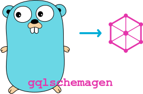

[](./art/logo.png)


# GQL Schema Gen - VS Code Extension

A VS Code extension that provides real-time validation, autocomplete, and documentation for [gqlschemagen](https://github.com/pablor21/gqlschemagen) `gql` struct tags and `@Gql` directives in Go code.

## Features

### 🔍 Real-time Validation
- Validates `gql` struct tag syntax
- Detects conflicting options (e.g., `optional` + `required`)
- Checks for unknown tag options
- Validates `@Gql` directive syntax and parameters
- Optional type reference checking

### 💡 IntelliSense & Autocomplete
- Tag option suggestions with documentation
- Type name completion for `include`, `omit`, `ro`, `wo`, `rw` lists
- Wildcard (`*`) suggestions

### 📚 Hover Documentation
- Detailed information about tag options
- Directive documentation with parameter details
- Parsed tag structure display

### 🛠️ Quick Fixes
- Remove conflicting options
- Fix common tag syntax issues
- Smart comma handling for lists

## Supported Features

### Struct Tag Options
- `type`: Override GraphQL type
- `description`: Add field description
- `deprecated`: Mark field as deprecated
- `optional`: Mark field as nullable
- `required`: Mark field as non-null
- `forceResolver`: Force resolver generation

### Field Filtering
- `include:TypeA,TypeB` - Include field only in specified types
- `omit:TypeA,TypeB` - Exclude field from specified types
- `ignore:TypeA,TypeB` - Alias for omit
- `ro` or `ro:TypeA` - Read-only (types only, not inputs)
- `wo` or `wo:TypeA` - Write-only (inputs only, not types)
- `rw` or `rw:TypeA` - Read-write (both types and inputs)

### Directives
- `@GqlType(name:"TypeName")` - Define GraphQL type
- `@GqlInput(name:"InputName")` - Define GraphQL input
- `@GqlEnum(name:"EnumName")` - Define GraphQL enum
- `@GqlNamespace(name:"Namespace")` - Group types
- `@GqlIgnore` - Ignore struct
- `@GqlIgnoreAll` - Ignore all structs in file

All directives support both `@gql` and `@Gql` prefixes (case-insensitive).

## Extension Settings

This extension contributes the following settings:

- `gqlschemagen.validation.enabled`: Enable/disable validation
- `gqlschemagen.validation.checkTypeReferences`: Check if type names in include/omit/ro/wo/rw lists exist
- `gqlschemagen.completion.enabled`: Enable/disable autocomplete

## Usage

1. Open a Go file with `gql` struct tags
2. The extension automatically validates tags and directives
3. Hover over tags/directives for documentation
4. Use autocomplete inside `gql:""` tags
5. Apply quick fixes for validation errors

### Example

```go
// @GqlType(name:"User")
type User struct {
	ID        string `gql:"id,ro"`
	Email     string `gql:"email,required"`
	Password  string `gql:"password,wo,description:User password"`
	Name      string `gql:"name,include:UserView,UserAdmin"`
	CreatedAt time.Time `gql:"created_at,optional,ro:UserAdmin"`
}
```

## Commands

- `GQL Schema Gen: Validate Tags` - Manually trigger validation

## Development

### Building from source

```bash
cd src/
npm install
npm run compile
```

### Debugging

Press F5 to launch the Extension Development Host with the extension loaded.

## Requirements

- VS Code 1.85.0 or higher
- Go files with `gql` struct tags

## Known Issues

- Type reference validation requires `@GqlType`/`@GqlInput` directives in the same file

## Release Notes

### 0.0.1

Initial release with:
- Tag validation
- Directive validation
- Autocomplete for tag options
- Hover documentation
- Quick fixes for common issues
- Support for field filtering (include/omit/ro/wo/rw)

## License

MIT
